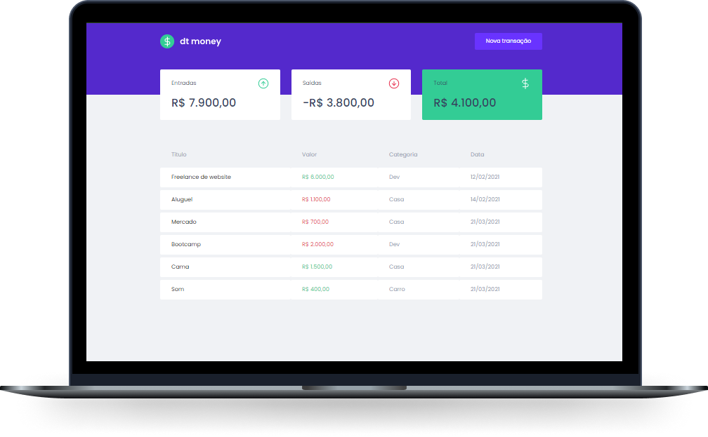

<p align="center">
  

  
 
  <a href="https://github.com/bfukumori/dtmoney/commits/master">
    
  </a>
    
   
   <a href="https://github.com/bfukumori/dtmoney/stargazers">
    
  </a>

  <a href="https://bfukumori.github.io/dtmoney/">
    
    </a>
 
</p>
<h1 align="center">
    
</h1>

<p align="center">
  <a href="#about">About</a> •
  <a href="#features">Features</a> •
  <a href="#layout">Layout</a> • 
  <a href="#how-it-works">How it works</a> • 
  <a href="#tech-stack">Tech Stack</a> • 
  <a href="#author">Author</a> • 
  <a href="#user-content-license">License</a>
</p>

<div align="center"> 
	
</div>

## About

💲 dtmoney - é uma planilha para controle de finanças.

Projeto desenvolvido durante a o curso de ReactJS do Ignite da [Rocketseat](https://www.rocketseat.com.br/ignite).

---

## Features

- [x] Users can create a new transaction by type (income, outcome)
- [x] The balance is calculated automatically
---

## Layout

The application layout is available on Figma:

<a href="https://www.figma.com/file/0xmu9mj2TJYoIOubBFWsk5/dtmoney-Ignite-(Copy)">
  
</a>

---

## How it works

### Pre-requisites

Before you begin, you will need to have the following tools installed on your machine:
[Git] (https://git-scm.com), [Node.js] (https://nodejs.org/en/).
In addition, it is good to have an editor to work with the code like [VSCode] (https://code.visualstudio.com/)

#### Running the web application (Frontend)

```bash

# Clone this repository
$ git clone git@github.com:bfukumori/dtmoney.git

# Access the project folder in your terminal
$ cd dtmoney

# Install the dependencies
$ npm install

# Run the application in development mode
$ npm run start

# The application will open on the port: 3000 - go to http://localhost:3000

```

---

## Tech Stack

The following tools were used in the construction of the project:

#### **Website**  ([React](https://reactjs.org/)  +  [TypeScript](https://www.typescriptlang.org/))

-   **[Miragejs](https://miragejs.com/)**
-   **[Styled Components](https://styled-components.com/)**
-   **[Axios](https://github.com/axios/axios)**
-   **[Polished](https://polished.js.org/)**

---
## Author

<a href="https://www.facebook.com/bruno.fukumori.9/">
 
 <br />
  
 <sub><b>Bruno Fukumori</b></sub></a> <a href="https://www.facebook.com/bruno.fukumori.9/" title="facebook"></a>
 <br />

[](https://twitter.com/hi_fukujp) [](https://www.linkedin.com/in/bfukumori/) 
[](mailto:brunofukumori@gmail.com)

---

## License

This project is under the license [MIT](./LICENSE).

---
